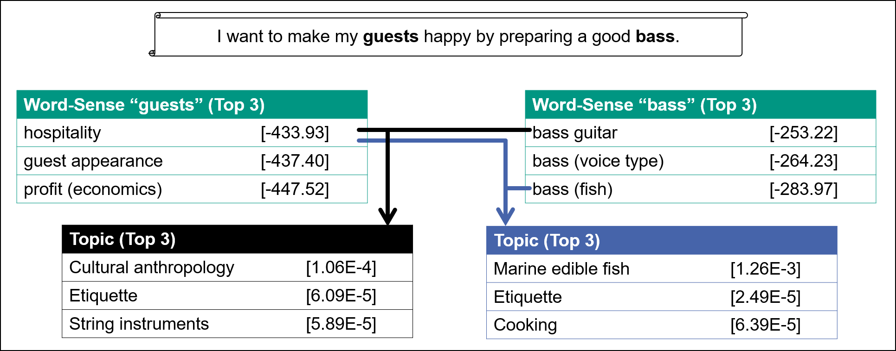
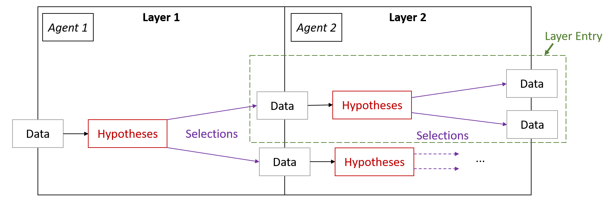

# Environment for Analysis of AGents based on Led Exploration (EAGLE)
This project contains an environment to explore the search space defined by hypotheses of agents of multi-agent systems (MAS).
The EAGLE is mainly based on the Master Thesis of Dominik Fuchss (cf. [Thesis](https://doi.org/10.5445/IR/1000126806)).
Therefore, this work can give you insight into the actual usage of this project.

# Table of Contents
* [What does EAGLE do?](#what-does-eagle-do)
* [Getting Started](#getting-started)
* [Structure of EAGLE](#structure-of-eagle)
  * [Port](#port)
  * [Platforms](#platforms)
  * [Specifications](#specifications)
  * [Exploration (eXplore)](#exploration-explore)
  * [Tests](#tests)
* [Explorer](#explorer)
* [Evaluator](#evaluator)
* [Example (PARSE)](#example-parse)
  * [PARSE Platform (Example)](#parse-platform-example)
  * [PARSE Specifications (Example)](#parse-specifications-example)

## What does EAGLE do?
EAGLE provides an easily extensible execution environment for agents of a multi-agent system.
The goal of EAGLE is to improve agent results by recombining *hypotheses* generated by agents.

Let's assume the following scenario (cf. image):



* Our multi-agent system consists of two agents:
  * the **Word Sense Disambiguation Agent** that provides multiple senses for words in a given input text
  * the **Topic Detection Agent** that uses the senses to provide topics for the whole input text
* Every agent provides an arbitrary score for certain possible results -- **a result + a score = a hypothesis**.
* The crucial question now is which hypothesis is correct. As you can see in the example in the picture, the sense of the word "bass", would be wrongly determined if only the scores were considered ("bass guitar").
* Thus, the right combination or selection of hypotheses is important. EAGLE provides the framework to explore these combinations and thus the *search space of hypotheses*. Two steps have to be distinguished here:
  * The **Exploration** that is controlled by `ISelectionProvider`. The exploration partly traverses the search space and provides an exploration result (take a look at [Explorer](#explorer))
  * The **Assessment/Rating** that uses `IRatingFunction` to extract results from a certain exploration result. The rating step analyzes the explored search space and determines the best paths (= results) according to a metric (= `IRatingFunction`). Further details can be found in [Thesis](https://doi.org/10.5445/IR/1000126806).

## Getting Started
At the moment EAGLE does not contain a main class to run, but is a library that can be used.
Therefore, a main project should be created first, which contains an executable main class.

**TODO MAVEN DEPENDENCY INFORMATION**

After you have added the dependencies you will need the following implementations:
* The Agent Specification of your agents
* The Data Structure that is uses by the agents to communicate
* A Exploration Strategy (e.g. [SimpleExploration](xplore/src/main/java/edu/kit/ipd/eagle/impl/xplore/SimpleExploration.java))
* A Rating Function (e.g. [NormalizedAggregate](xplore/src/main/java/edu/kit/ipd/eagle/impl/xplore/rating/NormalizedAggregate.java))

After that, you can simple use such a code snippet to invoke the exploration and rating:
```java
// Instantiate the agents within their agent specifications
AgentSpec specA = new AgentSpecA();
AgentSpec specB = new AgentSpecB();

// Define the exploration strategy
SimpleExploration<AgentSpec, DataStructure> explorer = new SimpleExploration<>(myDataStructure, id, maxHypotheses);
explorer.loadHypothesisAgent(specA);
explorer.loadHypothesisAgent(specB);

// Now start exploration
IExplorationResult result = explorer.explore();
List<IPath> paths = result.getPaths();

// Now rate the paths
IRatingFunction ratingFunction = new NormalizedAggregate(MEDIAN, ADD, 1E-8, 1 - 1E-8);
List<Double> ratings = ratingFunction.ratePaths(paths);

// Create Tuple of (IPath, Double) and sort descending
List<Tuple2<IPath, Double>> pathXRating = IntStream.range(0, paths.size()).mapToObj(i -> Tuple2.of(paths.get(i), ratings.get(i))).collect(Collectors.toList());
pathXRating.sort((p1, p2) -> -1 * Double.compare(p1.getSecond(), p2.getSecond()));

// Now you have your ordered paths that represents the results.
// E.g. the best result:
IExplorationResult bestResult = pathXRating.get(0).getFirst().toExplorationResult("dummy-text");
```

## Structure of EAGLE
This project is structured using maven modules. In the following, the structure is explained.

### Port
The port module defines all necessary modules to work with EAGLE.
Furthermore, common classes are defined as well.
Especially the following interfaces and classes are important:
* [IAgentSpecification](port/src/main/java/edu/kit/ipd/eagle/port/IAgentSpecification.java): Specifies the dependencies of a "normal" agent of a multi-agent system.
* [IAgentHypothesisSpecification](port/src/main/java/edu/kit/ipd/eagle/port/hypothesis/IAgentHypothesisSpecification.java): Specifies the dependencies of an agent that can deal with hypotheses. Such an agent is able to read and write hypotheses to a data structure. A hypothesis is defined by a value and a confidence.
* [IHypothesis](port/src/main/java/edu/kit/ipd/eagle/port/hypothesis/IHypothesis.java): Defines a hypothesis that can be created and/or used by agents.
* [IInformationId](port/src/main/java/edu/kit/ipd/eagle/port/IInformationId.java): In order to execute the agents of an MAS in the right order, you have to define the provided and required information of an agent. See [Example](#example-parse) for further information.

For the exploration of hypotheses, the following interfaces are important (a picture of what is described is included for illustration):

* [ILayer](port/src/main/java/edu/kit/ipd/eagle/port/xplore/layer/ILayer.java): During exploration, specified agents are executed in a valid sequence. During this process, agents can generate hypotheses. For a run of the exploration, a layer for an agent includes the input data, the hypotheses generated by the agents, and the selections of hypotheses made together with the resulting data structures.
* [ILayerEntry](port/src/main/java/edu/kit/ipd/eagle/port/xplore/layer/ILayerEntry.java): A layer entry is an entry within a layer ( :) ). One can equate an entry with a path segment within the exploration. Within a layer entry there is exactly one data of origin, the generated hypotheses, as well as the result data structures for the agent of the layer that were created by different selections.
* [ISelectionProvider](port/src/main/java/edu/kit/ipd/eagle/port/xplore/selection/ISelectionProvider.java): A selection provider is used in exploration to obtain different selections (parts of these hypotheses) from a set of hypotheses and to explore further based on these.
* [IRatingFunction](port/src/main/java/edu/kit/ipd/eagle/port/xplore/rating/IRatingFunction.java): A rating function can rate a set of paths. Paths here are `ILayerEntry[]`.
* [IExplorationResult](port/src/main/java/edu/kit/ipd/eagle/port/xplore/IExplorationResult.java): The result of the exploration is summarized in an `IExplorationResult`. It contains the input text and the first layer entry.
* [IExploration](port/src/main/java/edu/kit/ipd/eagle/port/xplore/IExploration.java): Defines the interface which is provided for exploring.

### Platforms
All agents depend on a certain platform that defines their operating data structures and the way they are executed.
Therefore, you need to define the platform of the agents you want to evaluate.
As an example the platform for [PARSE agents](https://code.ipd.kit.edu/weigelt/parse) is defined in this project (see [platforms/parse](platforms/parse/src/main/java/edu/kit/ipd/eagle/impl/platforms/parse)).
In order to work with agents in a certain platform, you have to implement at least the following interfaces:
* [IAgent](port/src/main/java/edu/kit/ipd/eagle/port/IAgent.java): The definition of an agent that operates on a certain data structure.
* [IDataStructure](port/src/main/java/edu/kit/ipd/eagle/port/IDataStructure.java): The definition of the data structure.
* [IAgentSpecification](port/src/main/java/edu/kit/ipd/eagle/port/IAgentSpecification.java) resp. [IAgentHypothesisSpecification](port/src/main/java/edu/kit/ipd/eagle/port/hypothesis/IAgentHypothesisSpecification.java) for certain agents you want to evaluate. The specifications of the example (PARSE) are described in [Specifications](#specifications).

### Specifications
Every agent that shall be executed by the EAGLE System needs a specification.
Some example specifications are provided in certain modules of the [Specification Module](specification/):
* [indirect](specification/indirect/src/main/java/edu/kit/ipd/eagle/impl/specification/indirect): Specifications of some [INDIRECT](https://code.ipd.kit.edu/hey/indirect) agents that operate on the PARSE Platform. No agent provides hypotheses. Therefore, you will only find `IAgentSpecification` in the module.


* [parse](specification/parse/src/main/java/edu/kit/ipd/eagle/impl/specification/parse): Specifications of some [PARSE](https://code.ipd.kit.edu/weigelt/parse) agents that operate on the PARSE Platform. No agent provides hypotheses. Therefore, you will only find `IAgentSpecification` in the module.


* [parse-hypotheses](specification/parse-hypotheses/src/main/java/edu/kit/ipd/eagle/impl/specification/parse): Specifications of some [PARSE](https://code.ipd.kit.edu/weigelt/parse) agents that operate on the PARSE Platform and are able to generate hypotheses. Therefore, you will find `IAgentSpecification` in the module as well as `IAgentHypothesisSpecification` in a subdirectory.

### Exploration (eXplore)
The [xplore](xplore/src/main/java/edu/kit/ipd/eagle/impl/xplore) module contains the necessary implementations to explore the search space of hypotheses.

Important classes and/or packages are:

* [Selection Providers](xplore/src/main/java/edu/kit/ipd/eagle/impl/xplore/selection): Some basic realizations of `ISelectionProvider` (cf. section 6.3 in [Thesis](https://doi.org/10.5445/IR/1000126806))
  * `FullExploration`
  * `RandomHypothesis`
  * `TopXConfidence`
  * `TopXSlidingWindow`
  * `SameWordSameDecision` (decorator that ensures that equal words have equal hypotheses selections)


* [Rating Functions](xplore/src/main/java/edu/kit/ipd/eagle/impl/xplore/rating): Some basic realizations of `IRatingFunction` ..
  * `NormalizedAggregate`: Configurable Rating function that normalizes hypotheses per Layer and determine the final scores of path by aggregation of scores of layer entries.


* `LayeredExploration` basic implementation of an exploration. Also take a look at the following subclasses:
  * `SimpleExploration`: out of the box exploration
  * `SpecificExploration`: exploration that has to be configured to use a certain selection provider per layer.

### Tests
The last module contains some integration tests.
Especially take a look at [SimpleHypothesesTest](tests/src/test/java/edu/kit/ipd/eagle/test/SimpleHypothesesTest.java).
This class may help you understanding how to use the project.

## Explorer
In order to visualize the exploration, the [explorer project](../eagle-explorer) has been realized. This explorer provides an overview on an `IExplorationResult`.


## Evaluator
In order to evaluate the exploration, the [evaluator project](../eagle-evaluator) has been realized. This evaluator provides an graphical (or textual) interface to perform a manual classification of all found hypotheses. After classification, you can use the classification to evaluate the actual exploration in terms of precision, recall, f1 score, and/or other classification metrics.


## Example (PARSE)
This repository implements the approach for the PARSE Platform and some PARSE agents.
They can be seen as an example how to work with EAGLE.
In the following, the needed steps to adopt this framework to other platforms or agents will be stated.

### PARSE Platform (Example)
In order to work with EAGLE, you have to define a Agent Platform.
Such a platform defines the kind of agents, how to invoke them, and the data structure they need (cf. [platforms](#platforms)).

For PARSE the realization consists of the following important classes:
* [PARSEGraphWrapper](platforms/parse/src/main/java/edu/kit/ipd/eagle/impl/platforms/parse/PARSEGraphWrapper.java): The adapter that provides the `IDataStructure` realization for PARSE.
* [PARSEAgent](platforms/parse/src/main/java/edu/kit/ipd/eagle/impl/platforms/parse/PARSEAgent.java): The adapter that provides the `IAgent` realization of an `AbstractAgent` (base class of agents in PARSE). The class contains the mechanisms to invoke the agent.
* [AbstractAgentSpecification](platforms/parse/src/main/java/edu/kit/ipd/eagle/impl/platforms/parse/specification/AbstractAgentSpecification.java): A base class for the specifications of the agents.
* [PARSEInformationId](platforms/parse/src/main/java/edu/kit/ipd/eagle/impl/platforms/parse/PARSEInformationId.java): The realization of `IInformationId` for the PARSE agents.

### PARSE Specifications (Example)
The structure of the specifications has been stated in [Specifications](#specifications).

As an example, you can take a look at the realization of the specifications of the Topic Extraction Agent:
* [TopicExtractionSpec](specification/parse-hypotheses/src/main/java/edu/kit/ipd/eagle/impl/specification/parse/TopicExtractionSpec.java): Defines the dependencies of the Topic Extraction by provided and required `PARSEInformationId`. In addition, it instantiates an instance of the agent. This specification does not provide any hypotheses.
* [TopicExtractionHypothesisSpec](specification/parse-hypotheses/src/main/java/edu/kit/ipd/eagle/impl/specification/parse/hypothesis/TopicExtractionHypothesisSpec.java): Extends a `TopicExtractionSpec` by defining methods to retrieve and apply hypotheses respective their selections.
